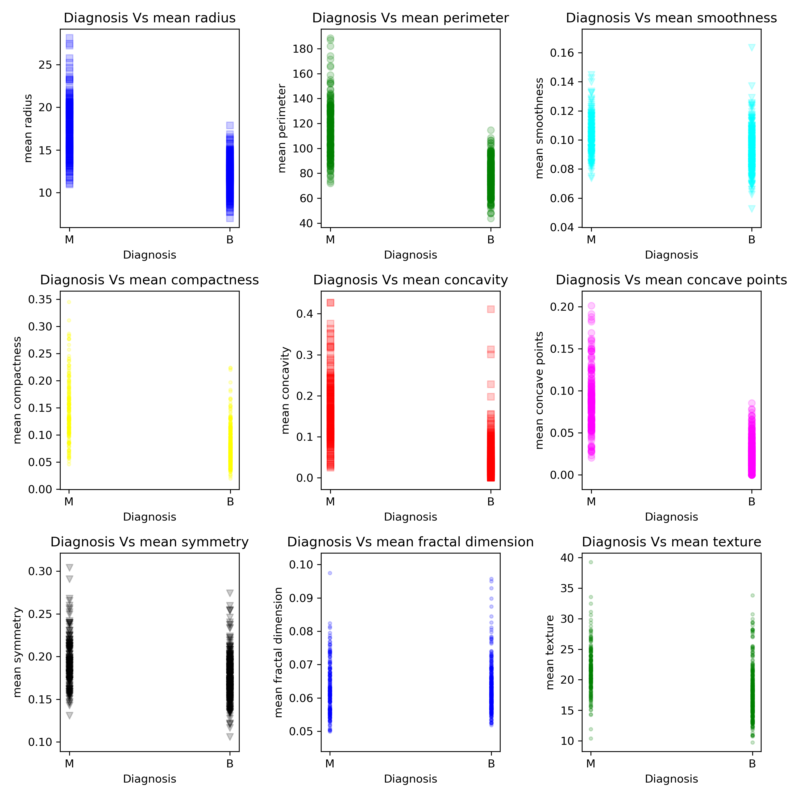
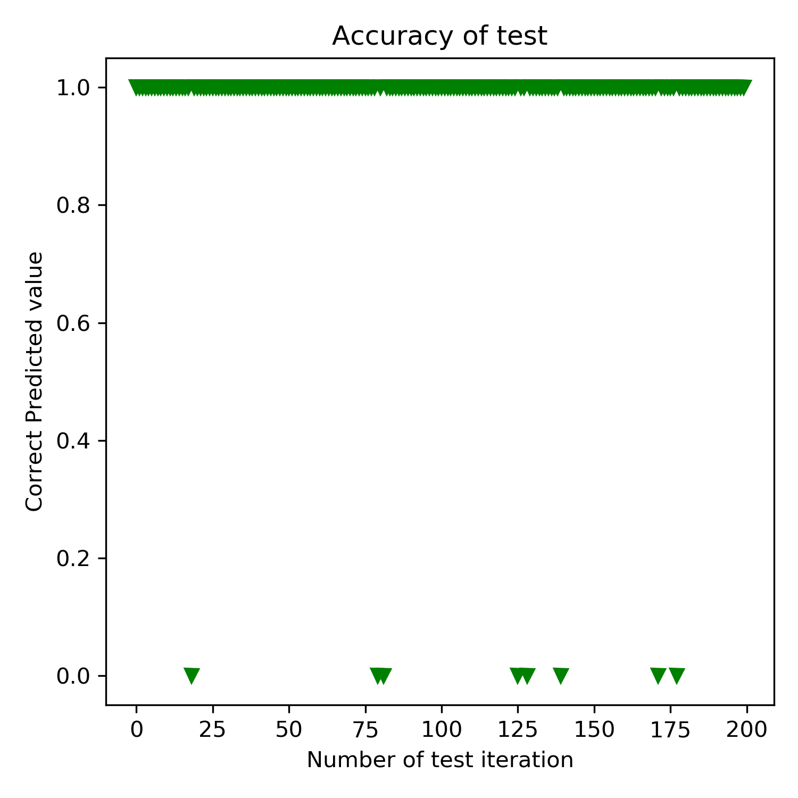

# CEBD-1160-BigDataTechnology
Final Project to introduction to big data technology

| Name | Date |
|:-------|:---------------|
|Vignesh Rajaram|March 28, 2020|

-----

### Resources
Your repository should include the following:

- Python script for your analysis: `cancer_prediction.py`
- Results figure/saved file:  `figures/`
- runtime-instructions in a file named RUNME.md

-----

## Research Question

Based on the geometrical characteristics of tumor to determine whether they are malignant or benign tumor?

### Abstract

In this project, based on the data available from Wisconsin Diagnostic Breast Cancer(WDBC): We are creating a model to predict the type of tumor based on the geometrical characteristics of tumor. This model will help in better and quick decision making on treatment for either malignant or benign tumor, with initial data on geometrical characteristics of tumor. Using logistic regression model available in sklearn library a model will be created to predict the behavior. Based on the F1 score of the regressor the initial test provided encouraging result, but due to its application in medical field the F1 score must be improved further.

### Introduction

There are two different types of tumor:
Malignant tumor - which may invade surrounding tissue or spread around the body
Benign tumor - which does not affect the surrounding tissue or spread around the body. [1]

The dataset obtained from the University of Wisconsin, describes the features of cell nuclei present in the digitized image. Based on the features obtained the type of tumor is predicted. The graphs are obtained from this dataset. More details about the dataset can be found in the file(./data/wdbc.names).

### Methods

The target in our dataset is to predict whether the tumor is either malignant or benign. Therefore this dataset falls under the classification model of the supervised machine learning. Hence, we use the Logistic Regressor built in scikit-learn for simplicity and applicability to the problem in hand. Psuedocode for the regressor can be found in this link (https://scikit-learn.org/stable/modules/generated/sklearn.linear_model.LogisticRegression.html)

To train the model [2] and to obtain the metrics of the model [3], methods are available in the scikit learn. The graph is generated to compare the mean values of the features with type of tumor. Based on the graph below, we could see that there isn't any major difference in the mean value of characteristics that differs malignant tumor from benign tumor.

### Results

The F1 score of the regressor is ~0.95 and the value can be improved by more data.

After doing trial and error method, with removing multiple features it is noted that more features we have in our dataset and more data in the dataset the F1 score improved. Hence we can say that by addding more data to training and testing the model the F1 score can be improved.

### Discussion

The method used here to determine the type of tumor has accuracy of 95%(approximately) and F1 score of ~0.95. Based on these numbers the model we created could solve the problem and predict the tumor. But the above number is not suitable for the field of application as the disease we are concentrating is terminal if untreated or wrongly treated. Therefore, more data is required to train the model, to increase the accuracy and F1 score. 

Hence, we could say that this model is partially complete and further development is required for application. This can be acheived by adding more features to dataset and more data.

### References
 [1] https://study.com/academy/lesson/benign-vs-malignant-definition-characteristics-differences.html
 [2] https://scikit-learn.org/stable/modules/generated/sklearn.model_selection.train_test_split.html
 [3] https://scikit-learn.org/stable/modules/model_evaluation.html

-------
